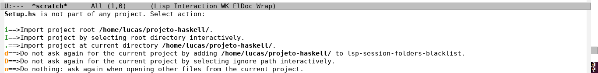

# Emacs config for haskell programming


## Descrição
Esse tutorial tem o objetivo de ajudar a preparar um ambiente de desenvolvimento simples e "funcional" para desenvolvimento na linguagem Haskell, utilizando o editor GNU/Emacs. Durante todo o "passo a passo" estarei supondo um ambiente GNU/Linux, mas você poderá acompanhar, com as devidas modificações, em qualquer outro tipo de sistema.

## Instalação do Emacs
Antes de tudo, devemos fazer uma instalação do emacs. Para isso podemos digitar a seguinte linha em um terminal:

```sh
sudo apt install emacs
```

## Instalação do Haskell Tool Stack
Para instalar o Stack basta digitar a seguinte linha no terminal:

```sh
wget -qO- https://get.haskellstack.org/ | sh
```
Muito provavelmente você deve obter um "warning" avisando que o Stack armazena os binários em '/home/$USER/.local/bin' pós build, e pedindo para que o diretório seja adicionado ao PATH. Cole a seguinte linha em seu arquivo ~/.bashrc

```sh
export PATH=$PATH:/home/$USER/.local/bin
```

No caso de o diretório ~/.local/bin não existir, crie com o comando abaixo:

```sh
mkdir ~/.local/bin
```

## Instalando Haskell Language Server
Podemos baixar haskell-language-server e haskell-language-server-wraper acessando a página abaixo:<br/>
https://github.com/haskell/haskell-language-server/releases<br/>
Para descobrir a versão do GCH que está sendo usada, digite a seguinte linha no terminal:
```sh
stack ghc -- --version
```
Extraia os dois arquivos baixados e mova ambos para a pasta ~/.local/bin. O arquivo haskell-language-server-[version] deve ser renomeado para haskell-language-server.<br/>
Os arquivos devem estar com permissão de execução, o que pode ser concedido com os seguintes comandos:

```sh
sudo chmod +x ~/.local/bin/haskell-language-server
sudo chmod +x ~/.local/bin/haskell-language-server-wrapper
```

## Configurando Emacs

Precisamos configurar os repositórios onde o emacs irá buscar os pacotes que iremos precisar. Para isso, insira o seguinte código em seu arquivo ~/.emacs:

```elisp
;; Verifica e inicia o package.el
(require 'package)

;; Definição de repositórios
(setq package-archives '(("melpa" . "https://melpa.org/packages/")
			 ("org" . "https://orgmode.org/elpa/")
			 ("elpa" . "https://elpa.gnu.org/packages/")))

;; Inicialização do sistema de pacotes
(package-initialize)
(unless package-archive-contents
  (package-refresh-contents))

;; Instalação do use-package
(unless (package-installed-p 'use-package)
  (package-install 'use-package))

(require 'use-package)
(setq use-package-always-ensure t)

```
Devemos agora instalar os pacotes responsáveis pelos recursos fundamentais do nosso ambiente. Para instalar um pacote no emacs via **package.el** basta executar M-x package-install RET nome-do-pacote RET.

**Lista de Pacotes**

* lsp-mode
* lsp-ui
* flycheck
* company
* lsp-treemacs
* helm-lsp
* lsp-ivy
* dap-mode
* lsp-haskell
* haskell-mode

Feito isso, adicione o seguinte código ao seu arquivo ~/.emacs:

```elisp
(use-package lsp-mode
  :init
  ;; set prefix for lsp-command-keymap (few alternatives - "C-l", "C-c l")
  (setq lsp-keymap-prefix "C-c l")
  :hook (;; replace XXX-mode with concrete major-mode(e. g. python-mode)
         (haskell-mode . lsp)
         ;; if you want which-key integration
         (lsp-mode . lsp-enable-which-key-integration))
  :commands lsp)

;; optionally
(use-package lsp-ui :commands lsp-ui-mode)
;; if you are helm user
(use-package helm-lsp :commands helm-lsp-workspace-symbol)
;; if you are ivy user
(use-package lsp-ivy :commands lsp-ivy-workspace-symbol)
(use-package lsp-treemacs :commands lsp-treemacs-errors-list)

;; optionally if you want to use debugger
(use-package dap-mode)
;; (use-package dap-LANGUAGE) to load the dap adapter for your language

;; optional if you want which-key integration
(use-package which-key
    :config
    (which-key-mode))

```

## Error package is unavailable ELPA
É possível que no passo anterior o emacs tenha problemas para encontrar algumas dependências no repositório ELPA, por exemplo, uma mensagem semelhante a: "Package spinner-1.7.3 is unavailable" pode ser exibida. Isso pode ocorrer devido à expiração da GPG keyring, que verifica a autenticidade dos pacotes baixados através do repositório GNU ELPA.

Você poderá resolver isso digitando o seguinte bloco no terminal:

```sh
keyserver hkp://keys.gnupg.net
gpg --homedir ~/.emacs.d/elpa/gnupg --receive-keys 066DAFCB81E42C40
```
Agora o emacs conseguirá coletar dados de ELPA sem nenhuma mensagem de erro. Execute **M-x package-refresh-contents RET** para atualizar os pacotes e dependências. 

## Testando
A configuração básica do nosso ambiente foi concluída. Para testar, podemos começar um novo projeto haskell via Stack e abri-lo no emacs. Basta inserir o seguinte bloco no terminal:

```sh
stack new projeto-haskell simple
cd projeto-haskell
emacs Setup.hs &
```
Uma mensagem como esta deve aparecer na parte inferior da tela: 

Você pode apertar "i" para definir a raiz do projeto como a pasta na qual você está.<br/>
Experimente abrir todos os arquivos do projeto utilizando treemacs, para testar se os pacotes estão funcionando corretamente.

## Error LSP Disconnected
Pode ocorrer de o LSP não ativar para alguns arquivos .sh e ativar para outros. Nesse caso experimente apagar todos os arquivos terminados em ".elc" na pasta dos pacotes lsp-mode e lsp-ui dentro de ~/.emacs.d/elpa.

## Feedback and Contributing
O objetivo deste guia é auxiliar na experiência do usuário iniciante no emacs, sendo assim, toda sugestão de melhorias e correção de erros é muito bem vinda.

